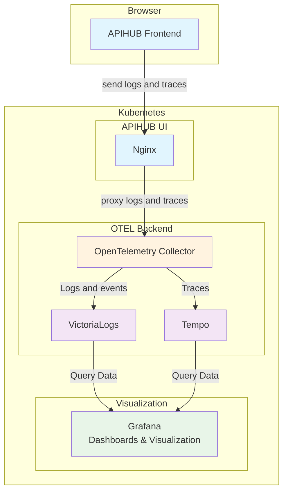

# Frontend RUM

## Grafana Faro + Qubership APIHUB

### Overview

To PoC I took Qubership APIHUB UI and integrate Grafana Faro in it UI. No other changes made.

Qubership APIHUB UI changes:

- Branch [https://github.com/Netcracker/qubership-apihub-ui/tree/feature/integrate-grafana-faro](https://github.com/Netcracker/qubership-apihub-ui/tree/feature/integrate-grafana-faro)
- PR [https://github.com/Netcracker/qubership-apihub-ui/pull/278](https://github.com/Netcracker/qubership-apihub-ui/pull/278)

Used Grafana Faro library:

- [https://github.com/grafana/faro-web-sdk](https://github.com/grafana/faro-web-sdk)

For backends to save data used:

- VictoriaLogs - for logs and events
- Grafana Tempo - for traces

### Working Flow



### How to display this information?

Logs and events store in VictoriaLogs as logs and can be selected from VictoriaLogs directly:


Traces (currently only page calls) store in Grafana Tempo and also can be selected directly from Tempo:


Also, in Grafana we can make a dashboard that will show data, graphs:


JSON for this dashboard already added in PoC and available in [Grafana Faro VictoriaLogs](apihub-faro-docker-compose/config/grafana/provisioning/dashboards/grafana-faro-victorialogs.json).

### Run PoC

Based of official docker compose from [https://github.com/Netcracker/qubership-apihub/tree/main/docker-compose/apihub-generic](https://github.com/Netcracker/qubership-apihub/tree/main/docker-compose/apihub-generic).

But it extended:

- Added OpenTelemetry Collector
- Added VictoriaLogs
- Added Grafana Tempo
- Added Grafana

Small changes in configurations.

#### Requirements

- docker or podman
- docker compose or podman compose

#### How to run PoC

1. Clone this repository

    ```bash
    git clone git@github.com:Netcracker/qubership-observability-examples.git
    ```

2. Navigate to `researches/frontend-rum/apihub-faro-docker-compose`

    ```bash
    cd researches/frontend-rum/apihub-faro-docker-compose
    ```

3. Run script to generate all ENVs and JWT keys:

    ```bash
    ./generate.sh
    ```

4. Print credentials for Qubership APIHUB UI using the command:

    ```bash
    cat qubership-apihub-backend-config.yaml
    ```

    in the section `zeroDayConfiguration` you can find email and password to login:

    ```yaml
    zeroDayConfiguration:
      adminEmail: <email>
      adminPassword: <password>
    ```

5. Run docker compose

    ```bash
    docker compose up
    ```

    > Note: All env and api keys already filled

6. Login in APIHUB and Grafana to see events

Available UIs:

- APIHUB UI - [http://localhost:8081](http://localhost:8081)
- Grafana - [http://localhost:3000](http://localhost:3000)
- VictoriaLogs - [http://localhost:9428](http://localhost:9428)
- Tempo - [http://localhost:3000](http://localhost:3000) (inside the Grafana, Explore -> Tempo)

Credentials:

- APIHUB - see above how to find
- Grafana - admin / admin

## OpenTelemetry Browser + Qubership APIHUB

### Run PoC

Based of official docker compose from [https://github.com/Netcracker/qubership-apihub/tree/main/docker-compose/apihub-generic](https://github.com/Netcracker/qubership-apihub/tree/main/docker-compose/apihub-generic).

But it extended:

- Added OpenTelemetry Collector
- Added VictoriaLogs
- Added Grafana Tempo
- Added Grafana

Small changes in configurations.

#### Requirements

- docker or podman
- docker compose or podman compose

#### How to run PoC

1. Clone this repository

    ```bash
    git clone git@github.com:Netcracker/qubership-observability-examples.git
    ```

2. Navigate to `researches/frontend-rum/apihub-otel-browser-docker-compose`

    ```bash
    cd researches/frontend-rum/apihub-otel-browser-docker-compose
    ```

3. Run script to generate all ENVs and JWT keys:

    ```bash
    ./generate.sh
    ```

4. Print credentials for Qubership APIHUB UI using the command:

    ```bash
    cat qubership-apihub-backend-config.yaml
    ```

    in the section `zeroDayConfiguration` you can find email and password to login:

    ```yaml
    zeroDayConfiguration:
      adminEmail: <email>
      adminPassword: <password>
    ```

5. Run docker compose

    ```bash
    docker compose up
    ```

    > Note: All env and api keys already filled

6. Login in APIHUB and Grafana to see events

Available UIs:

- APIHUB UI - [http://localhost:8081](http://localhost:8081)
- Grafana - [http://localhost:3000](http://localhost:3000)
- VictoriaLogs - [http://localhost:9428](http://localhost:9428)
- Tempo - [http://localhost:3000](http://localhost:3000) (inside the Grafana, Explore -> Tempo)

Credentials:

- APIHUB - see above how to find
- Grafana - admin / admin
